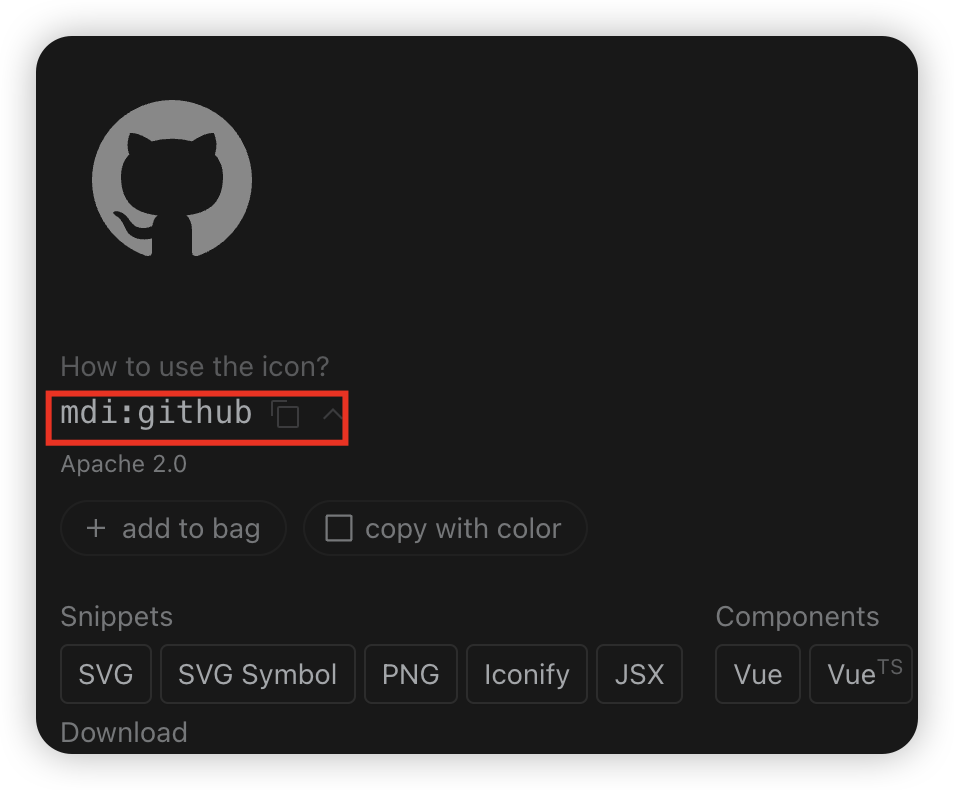

# Icons

This article introduces the usage of `Icons`, which typically includes the following methods:

- `UI Library Icons`
- `Iconify Icons`
- `Svg Icons`

## UI Library Icons

`UI Library Icons` is a common way to use icons, typically built into the `UI` library. Since this template has integrated `Vant UI`, you can directly use `Vant Icon`. Here's how to use it:

```html
<!-- Basic usage -->
<van-icon name="chat-o" />

<!-- Using image URL -->
<van-icon name="https://fastly.jsdelivr.net/npm/@vant/assets/icon-demo.png" />

<!-- Icon color and size -->
<van-icon name="cart-o" color="#1989fa" size="40" />
```

For more usage details, please refer to [Vant Icon](https://vant-ui.github.io/vant/?source=vuejsorg#/zh-CN/icon)

## Iconify Icons

`Iconify` provides native icon components for various popular UI frameworks. What advantages does it have compared to other icon components?

- One syntax for over 200,000 icons from more than 150 icon sets.
- Renders SVG. Many components simply render icon fonts, which look unappealing. Iconify exclusively uses pixel-perfect SVG.
- Load icons as needed. No need to bundle icons; the component will automatically load icon data from the Iconify API when you use them.

This template has integrated `Iconify`. Here's how to use it:

1. Search for icons on [icones](https://icones.js.org/), find the icon you need, such as `github`, click on the icon to view details, and copy the value in the red box, for example, `mdi:github`.



2. Use the `IconifyIcon` component in your component and pass `mdi:github` to the `icon` prop, like this:

```vue
<IconifyIcon icon="mdi:github" />
```

The `IconifyIcon` here is a custom component, which you can find in `src/components/IconifyIcon/index.vue`.

The `icones` icon set shown above is just one of the icon sets supported by `Iconify Icon`. For more usage details about `Iconify Icon`, please refer to [Iconify](https://iconify.design/docs/icon-components/vue/)

## Svg Icons

`Svg Icons` is a common way to use icons, typically by placing `svg` icon files in the `assets/icons` directory and then using the `SvgIcon` component in your components by passing the `svg` icon filename to the `icon` prop, like this:

```vue
<SvgIcon icon="github" />
```

The `SvgIcon` here is a custom component, which you can find in `src/components/SvgIcon/index.vue`.

## Related Links

- [Vant Icon](https://vant-ui.github.io/vant/?source=vuejsorg#/zh-CN/icon)
- [Iconify](https://iconify.design/docs/icon-components/vue/)
- [icones](https://icones.js.org/)
