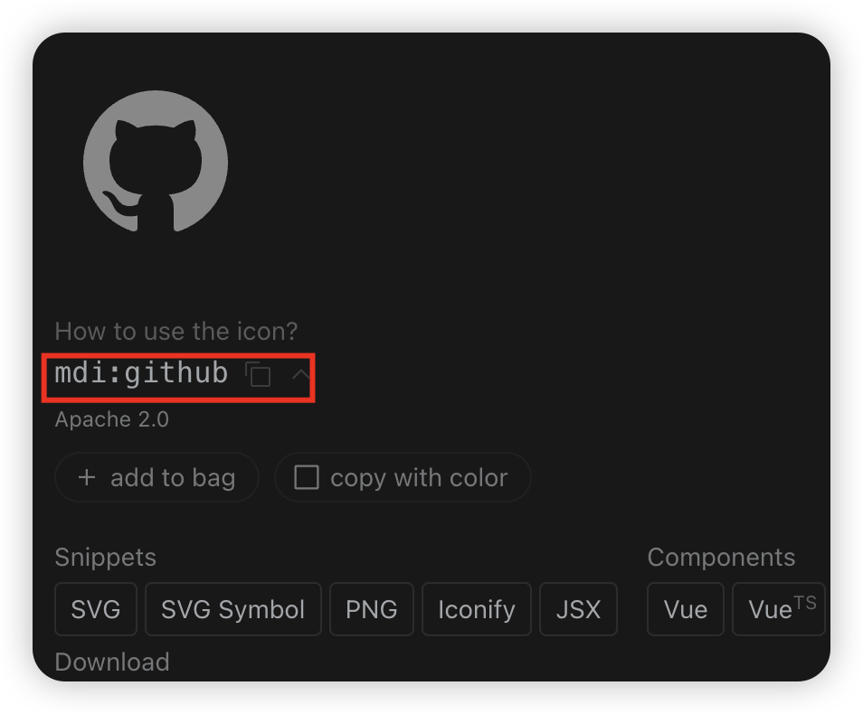

# 图标

本文主要介绍了 `图标` 的使用方式，通常有以下几种方式使用图标：

- `UI 库 Icons`
- `Iconify Icons`
- `Svg Icons`

## UI 库 Icons

`UI 库 Icons` 是一种常见的图标使用方式，通常是在 `UI` 库中内置的图标，本模版由于内置了 `React-Vant UI`，所以可以直接使用 `React-Vant Icon`，使用方式如下：

```tsx
// 基础用法
import React from 'react';
import { Space } from 'react-vant';
import { LocationO, LikeO, StarO } from '@react-vant/icons';

export default () => {
  return (
    <Space className="demo-icon" gap={20}>
      <LocationO />
      <LikeO />
      <StarO />
    </Space>
  );
};

// 图标颜色和大小
import React from 'react';
import { Space } from 'react-vant';
import { ChatO, FireO } from '@react-vant/icons';

export default () => {
  return (
    <Space className="demo-icon" gap={20}>
      <ChatO color="#f44336" fontSize="40px" />
      <FireO color="#3f45ff" fontSize="40px" />
    </Space>
  );
};
```

更多用法请参考 [React-Vant Icon](https://react-vant.3lang.dev/components/icon)

## Iconify Icons

`Iconify` 为多种流行的 UI 框架提供原生图标组件。与其他图标组件相比有哪些优势？

- 一种语法适用于 150 多个图标集中的 200,000 多个图标。
- 渲染 SVG。许多组件只是简单地渲染图标字体，看起来很难看。 Iconify 仅使用像素完美的 SVG。
- 根据需要加载图标。无需捆绑图标，组件将自动加载您从 Iconify API 使用的图标的图标数据。

本模版内置了 `Iconify`，使用方式如下：

1. 在 [icones](https://icones.js.org/) 搜索图标，在里面找到你需要的图标，例如 `github`，然后点击该图标查看详情，复制红框里的值，例如 `mdi:github`。



2. 在你的组件中使用 `IconifyIcon` 组件，将 `mdi:github` 传入 `icon` 属性即可，例如：

```tsx
import IconifyIcon from '@/components/Icon/IconifyIcon';

export default () => {
  return <IconifyIcon icon="mdi:github" />;
};
```

此处的 `IconifyIcon` 是一个自定义组件，你可以在 `src/components/Icon/IconifyIcon.tsx` 中查看。

上面示例中 `icones` 图标集只是 `Iconify Icon` 支持的其中一种图标集，关于 `Iconify Icon` 更多用法请参考 [Iconify](https://iconify.design/docs/icon-components/react/)

## Svg Icons

`Svg Icons` 是一种常见的图标使用方式，通常是将 `svg` 图标文件放在 `assets/icons` 目录下，然后在组件中使用 `SvgIcon` 组件，将 `svg` 图标文件名传入 `icon` 属性即可，例如：

```tsx
import SvgIcon from '@/components/Icon/SvgIcon';

export default () => {
  return <SvgIcon icon="github" />;
};
```

此处的 `SvgIcon` 是一个自定义组件，你可以在 `src/components/Icon/SvgIcon.tsx` 中查看。

## 相关链接

- [React-Vant Icon](https://react-vant.3lang.dev/components/icon)
- [Iconify](https://iconify.design/docs/icon-components/react/)
- [icones](https://icones.js.org/)
